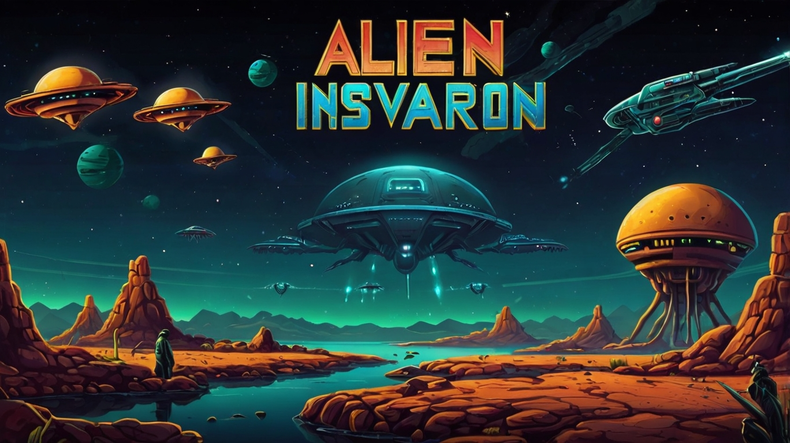

<div align="center">
  
</div>

## 📂Table of Contents
- [📋Project Description](#project-description)
- [✨Features](#features)
- [⛏️Built Using](#️built-using)
- [🎫 Dependencies](#-dependencies)
- [📥 Installation](#-installation)
  - [Using pip](#using-pip)
  - [Using conda](#using-conda)
- [📝Usage](#usage)
- [✍Authors](#authors)
- [💳License](#license)
- [🏅Acknowledgments](#acknowledgments)

 
## 📋Project Description
A simple alien invasion game that the user can interact with by destroying aliens' spaceships using a spaceship

<div align="center">
  <video src="https://github.com/mohammed-dhabaab/alien-invasion/assets/87764538/f34afa02-e1a2-42b4-a7ec-2d3620dc10b5" />
</div>

## ✨Features 
- The player controls a spaceship at the bottom of the screen
- The ship can move left and right using the arrow keys
- The ship can fire bullets upwards by pressing the space bar
- Rows of alien spaceships appear at the top of the screen and move back and forth
- The game stops when the user hits aliens' spaceships or when he closes the window
- The user can destroy all aliens' spaceships and more aliens' spaceships will appear

## ⛏️Built Using
Backend and Frontend:
<p>
<a href="https://www.python.org/" target="_blank" rel="noreferrer"></a>
<a href="https://www.pygame.org/" target="_blank" rel="noreferrer"></a>
</p>

Assets:
- [Python Crash Course, 3rd Edition Book](https://nostarch.com/python-crash-course-3rd-edition): Provided spaceships
- [@Mohammed-Dhabaab](https://github.com/mohammed-dhabaab): Provided the banner and the video demo


## 🎫 Dependencies
- [Python=3.11.0](https://www.python.org/)
  - [Pygame=2.5.2](https://www.pygame.org/)

## 📥 Installation
### Using pip
1. You need to install [Python=3.11.0](https://www.python.org/downloads/release/python-3110/), to ensure compatibility
2. Add python to environment variables (PATH)
3. Use the package manager pip to install pygame=2.5.2:
    ```shell
    pip install pygame=2.5.2
    ```

### Using conda
1. Create alien_invasion environment:
    ```shell
    conda env create -f environment.yml
    ```

2. Activate alien_invasion environment:
    ```shell
    conda activate alien_invasion
    ```

3. Run the program:
    ```shell
    python src/main.py
    ```

## 📝Usage
To play the Alien Invasion game, follow these steps:
1. Clone or download the project
2. Follow [📥 Installation](#-installation) process
3. After running the program
   - To move the spaceship use the arrow keys
   - To shoot by the spaceship press space

## ✍Authors
- [@Mohammed-Dhabaab](https://github.com/mohammed-dhabaab)


## 💳License
- [GNU AGPLv3](https://choosealicense.com/licenses/agpl-3.0/)


## 🏅Acknowledgments
- [Python Crash Course, 3rd Edition Book](https://nostarch.com/python-crash-course-3rd-edition): One of the resources I learned Python through it
